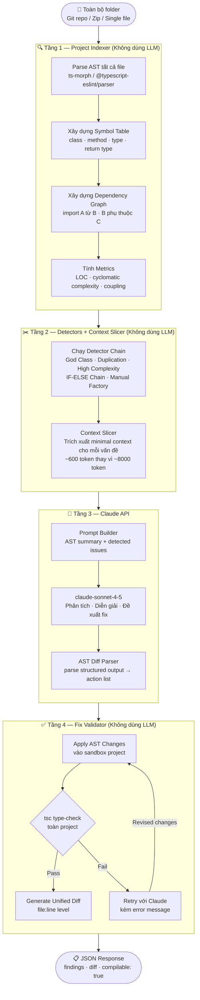
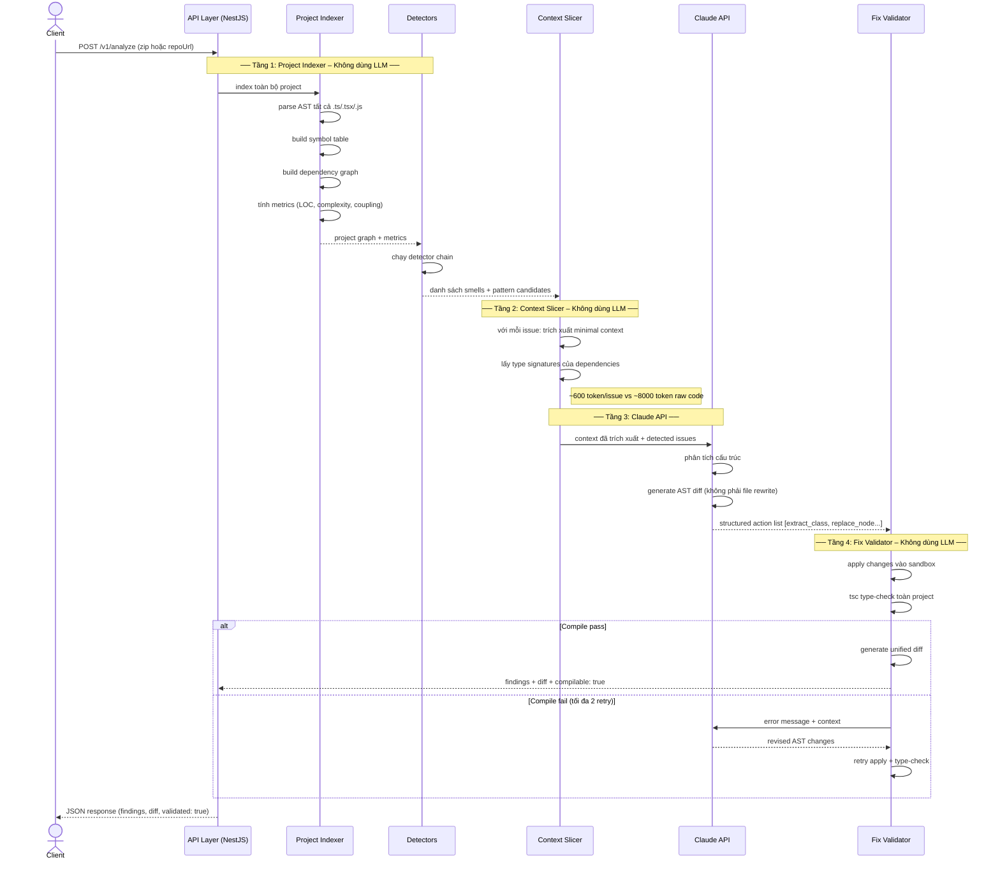
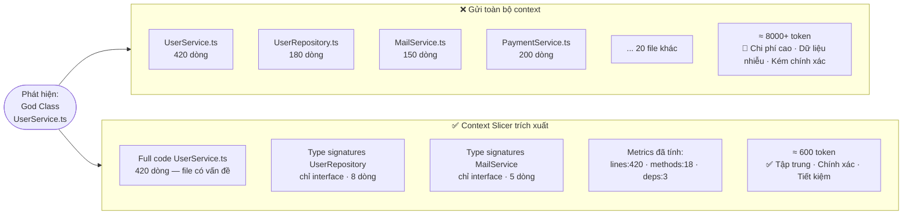
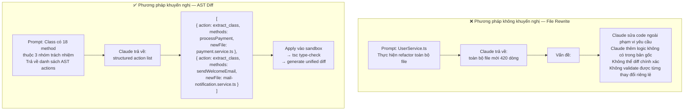
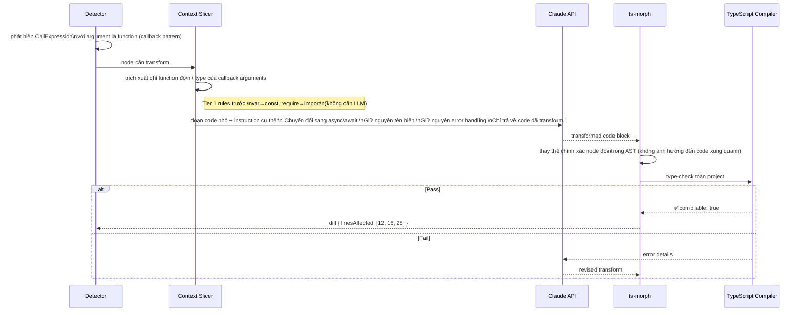
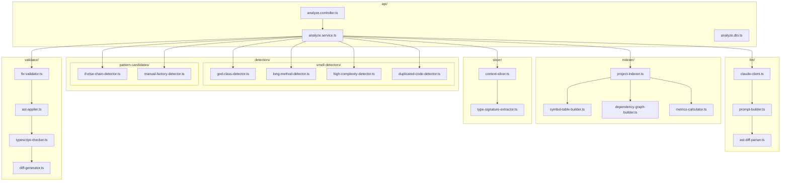
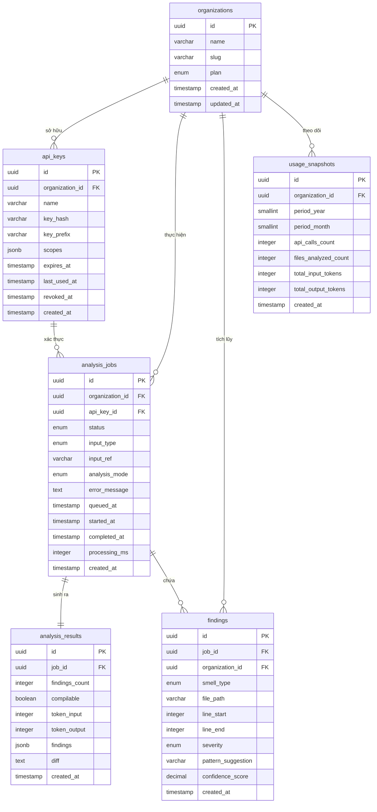
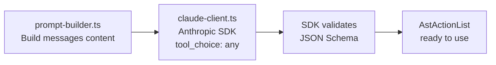

# Kiến trúc Hệ thống — Refactoring & Design Pattern Agent

## 1. Vấn đề Kỹ thuật Cốt lõi

### Lý do không thể gửi toàn bộ folder lên LLM

| Vấn đề | Hệ quả |
|--------|--------|
| Token limit | Codebase thực tế 10k+ dòng → vượt context window |
| Chi phí cao | Gửi raw code = 10–50x token so với gửi structured summary |
| Kém chính xác | LLM sinh ra file:line không tồn tại; không có khả năng suy luận kiểu dữ liệu từ file khác |
| Rủi ro khi apply fix | Không thể xác định thay đổi tại file A có gây lỗi tại file B hay không |

---

## 2. Tổng quan Kiến trúc 4 Tầng



---

## 3. Sequence Diagram — Luồng Xử lý một Request



---

## 4. Context Slicer — Lý do chỉ gửi 600 token



---

## 5. Fix Validator — Lý do dùng AST Diff thay vì File Rewrite



---

## 6. Modernization Pipeline — Callback Hell → Async/Await



---

## 7. Cấu trúc Module



---

## 8. Tech Stack

| Tầng | Công nghệ | Lý do |
|------|----------|-------|
| API Framework | NestJS (TypeScript) | Module hóa, DI, phù hợp dịch vụ B2B |
| AST + Type System | `ts-morph` | TypeScript Language Service đầy đủ, type-aware |
| JS/JSX không có types | `@typescript-eslint/parser` | Xử lý plain JS, JSX, decorator |
| Duplication | `jscpd` (library mode) | Token fingerprint, cross-file detection |
| LLM Client | `@anthropic-ai/sdk` | Official SDK — HTTP, auto-retry, streaming, tool_use |
| LLM Model | `claude-sonnet-4-5` | Context window lớn, hiểu code tốt |
| Schema validation | `zod` | Type-safe API contract |
| Testing | Vitest + Supertest | Unit + integration test |
| Runtime | Node.js 20 LTS | Cùng hệ sinh thái với target codebase |

---

## 9. Cấu trúc Thư mục Dự án

```
src/
├── main.ts
├── app.module.ts
│
├── api/                                  # HTTP layer
│   ├── api.module.ts
│   ├── analyze.controller.ts
│   ├── analyze.service.ts
│   └── dto/
│       ├── analyze-request.dto.ts
│       └── analyze-response.dto.ts
│
├── indexer/                              # Tầng 1 — Project Indexer (không dùng LLM)
│   ├── indexer.module.ts
│   ├── project-indexer.ts
│   ├── symbol-table-builder.ts
│   ├── dependency-graph-builder.ts
│   └── metrics-calculator.ts
│
├── detectors/                            # Tầng 2 — Detectors (không dùng LLM)
│   ├── detectors.module.ts
│   ├── base-detector.ts
│   ├── smell-detectors/
│   │   ├── god-class-detector.ts
│   │   ├── long-method-detector.ts
│   │   ├── high-complexity-detector.ts
│   │   └── duplicated-code-detector.ts
│   └── pattern-candidates/
│       ├── if-else-chain-detector.ts
│       └── manual-factory-detector.ts
│
├── slicer/                               # Tầng 2 — Context Slicer (không dùng LLM)
│   ├── slicer.module.ts
│   ├── context-slicer.ts
│   └── type-signature-extractor.ts
│
├── llm/                                  # Tầng 3 — Claude API
│   ├── llm.module.ts
│   ├── claude-client.ts
│   ├── prompt-builder.ts
│   └── ast-diff-parser.ts
│
├── validator/                            # Tầng 4 — Fix Validator (không dùng LLM)
│   ├── validator.module.ts
│   ├── fix-validator.ts
│   ├── ast-applier.ts
│   ├── typescript-checker.ts
│   └── diff-generator.ts
│
└── common/
    ├── types/
    │   ├── analysis-job.types.ts
    │   ├── finding.types.ts
    │   └── ast-action.types.ts
    └── exceptions/
        └── analysis.exception.ts

test/
├── e2e/
│   └── analyze.e2e-spec.ts
└── unit/
    ├── detectors/
    │   ├── god-class-detector.spec.ts
    │   └── high-complexity-detector.spec.ts
    └── indexer/
        └── project-indexer.spec.ts
```

---

## 10. Thiết kế Cơ sở Dữ liệu

### Entity Relationship Diagram



### Mô tả Bảng

| Bảng | Mục đích |
|------|---------|
| `organizations` | Tenant B2B — mỗi công ty khách hàng là một record |
| `api_keys` | Quản lý xác thực; lưu hash, không lưu key thật; hỗ trợ revoke |
| `analysis_jobs` | Theo dõi vòng đời mỗi request phân tích (queued → processing → completed/failed) |
| `analysis_results` | Kết quả đầy đủ của job: findings JSON, unified diff, trạng thái compile |
| `findings` | Bản ghi denormalized từng vấn đề phát hiện — phục vụ query xu hướng và báo cáo |
| `usage_snapshots` | Tổng hợp theo tháng phục vụ billing và rate limiting |

### Enum Values

| Enum | Giá trị |
|------|--------|
| `organizations.plan` | `free`, `pro`, `enterprise` |
| `analysis_jobs.status` | `queued`, `processing`, `completed`, `failed` |
| `analysis_jobs.input_type` | `zip`, `repo_url`, `single_file` |
| `analysis_jobs.analysis_mode` | `smell_detect`, `pattern_suggest`, `modernize`, `full` |
| `findings.smell_type` | `god_class`, `long_method`, `high_complexity`, `duplicated_code`, `feature_envy` |
| `findings.severity` | `low`, `medium`, `high`, `critical` |

---

## 11. Chi tiết Module LLM — `@anthropic-ai/sdk`

### 11.1. Tại sao `@anthropic-ai/sdk`, không dùng LangChain hay Vercel AI SDK

| Package | Đánh giá |
|---------|---------|
| `@anthropic-ai/sdk` | ✅ Official, thin wrapper, đủ feature (tool_use, streaming, retry), không overhead |
| `langchain` | ❌ Abstraction nhiều tầng, khó debug khi cần control chính xác prompt |
| `ai` (Vercel AI SDK) | ❌ Tối ưu cho streaming UI, không phù hợp NestJS service thuần backend |

---

### 11.2. Vấn đề cốt lõi — Tại sao `tool_use` thay thế `ast-diff-parser.ts`

Với phương pháp **text/JSON tự parse** (cũ):

```
Claude trả về:
"Tôi đề xuất trích xuất các method sau:
{ action: "extract_class", methods: ["processPayment"] ... }"
```

Vấn đề: Claude đôi khi thêm text thừa, sai JSON syntax → `ast-diff-parser.ts` phải xử lý nhiều edge case, dễ fail.

Với **`tool_use`** (mới): SDK *force* Claude phải gọi tool theo schema đã định nghĩa → response luôn là validated JSON, không có text thừa.

---

### 11.3. Tool Schema cho AST Actions

`claude-client.ts` định nghĩa tool này và truyền vào mỗi request:

```typescript
const AST_DIFF_TOOL: Anthropic.Tool = {
  name: 'apply_ast_changes',
  description: 'Return a structured list of AST transformations to apply to the codebase',
  input_schema: {
    type: 'object' as const,
    properties: {
      actions: {
        type: 'array',
        items: {
          type: 'object',
          properties: {
            action: {
              type: 'string',
              enum: ['extract_class', 'extract_method', 'replace_node', 'convert_async', 'rename_symbol']
            },
            targetFile: { type: 'string', description: 'Relative path of file to modify' },
            newFile:    { type: 'string', description: 'New file path when extracting class/method' },
            methods:    { type: 'array', items: { type: 'string' }, description: 'Method names to move' },
            nodeId:     { type: 'string', description: 'Unique node identifier from AST summary' },
            transformed:{ type: 'string', description: 'Transformed code block for replace_node / convert_async' }
          },
          required: ['action', 'targetFile']
        }
      },
      rationale: {
        type: 'string',
        description: 'One-sentence explanation of why these changes fix the detected issue'
      }
    },
    required: ['actions', 'rationale']
  }
}
```

---

### 11.4. Luồng gọi trong `claude-client.ts`

```typescript
import Anthropic from '@anthropic-ai/sdk'

export class ClaudeClient {
  private client: Anthropic

  constructor() {
    this.client = new Anthropic()  // đọc ANTHROPIC_API_KEY từ env tự động
  }

  async analyzeIssue(prompt: string): Promise<AstActionList> {
    const response = await this.client.messages.create({
      model: 'claude-sonnet-4-5',
      max_tokens: 4096,
      tools: [AST_DIFF_TOOL],
      tool_choice: { type: 'any' },  // force Claude phải dùng tool, không được trả text thuần
      messages: [{ role: 'user', content: prompt }]
    })

    const toolUse = response.content.find(b => b.type === 'tool_use')
    if (!toolUse || toolUse.type !== 'tool_use') {
      throw new AnalysisException('Claude did not return tool_use block')
    }

    return toolUse.input as AstActionList  // đã validated bởi SDK — không cần parse thêm
  }
}
```

---

### 11.5. Tác động đến Module `llm/`

| File | Vai trò sau khi dùng SDK |
|------|--------------------------|
| `claude-client.ts` | Khởi tạo `Anthropic()`, gọi `messages.create`, trả về `toolUse.input` |
| `prompt-builder.ts` | Vẫn cần — build message content từ AST summary + detected issues |
| `ast-diff-parser.ts` | **Bỏ** — tool_use đã thay thế hoàn toàn; chỉ cần cast type |



---

### 11.6. Retry khi Claude trả về fix không compile (Tầng 4)

SDK tự retry HTTP 5xx. Tầng 4 cần retry ở tầng business logic (compile fail):

```typescript
async analyzeWithRetry(prompt: string, maxRetries = 2): Promise<AstActionList> {
  let lastError: string | undefined

  for (let attempt = 0; attempt <= maxRetries; attempt++) {
    const fullPrompt = lastError
      ? `${prompt}\n\nPrevious attempt failed TypeScript compilation:\n${lastError}\nPlease revise.`
      : prompt

    const actions = await this.analyzeIssue(fullPrompt)
    const result = await this.fixValidator.validate(actions)

    if (result.compilable) return actions
    lastError = result.errorMessage
  }

  throw new AnalysisException(`Failed after ${maxRetries} retries`)
}
```

---

## 12. Câu hỏi Còn mở

- Validate `compilable` dùng `tsc` (đầy đủ nhưng chậm ~3–5s) hay chỉ parse-check (nhanh ~200ms)?
- Xử lý project không có `tsconfig.json` (plain JS) như thế nào?
- Retry strategy khi Claude trả về fix không compile: gửi lại error message hay escalate lên model có năng lực cao hơn?
- Sandbox khi apply changes: dùng in-memory virtual FS hay temp directory?
